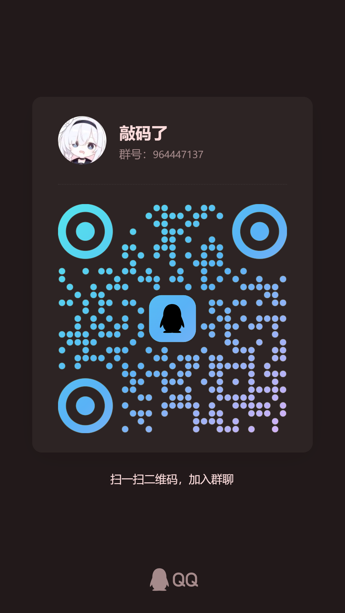

<div align="center">


# 好感度/关系管理插件 (Ultra)

[](#10-版本信息) 
[](#11-未来计划)
[](#联系)

> **最新动态 (2026-01-09)**
>
> ❗ **重要升级**：v3.1.0 版本引入了 SQLite 数据库存储，启动时会自动迁移旧版 JSON 数据。
> * 请务必在更新后重载插件以应用新的配置结构。

</div>

---

## 📖 插件概述

本插件为 AstrBot 赋予了具备持久记忆的**好感度与人际关系系统**。它不仅仅是一个数值计数器，而是通过深度集成 LLM，让 Bot 能够根据交互历史自然地演化与用户的关系（如陌生人、朋友、恋人、死敌等）。

**核心特性：**

*   **沉浸式交互**：好感度变化由 LLM 根据对话内容自动判断，无需用户手动指令。
*   **可视化报表**：支持生成精美的图片报表，直观展示群内或全局的好感度排行。
*   **冷暴力系统**：当好感度过低时，Bot 会模拟真实情绪，拒绝回复或敷衍用户。
*   **高性能存储**：基于 SQLite 数据库，支持海量用户数据的高效读写与查询。
*   **多维度管理**：支持全局模式（全平台共享）与会话隔离模式（单群独立）。

---

## 📦 安装与配置

### 安装方法

1.  **插件市场安装**：在 AstrBot 管理面板搜索 `Favour_Ultra` 或 `糯米茨` 进行安装。
2.  **手动安装**：

```bash
cd data/plugins
git clone https://github.com/nuomicici/astrbot_plugin_Favour_Ultra
# 重启 AstrBot 或重载插件
```

### 配置文件说明

插件配置已升级为嵌套结构，请在 AstrBot 管理面板中进行设置。

#### 1. 基础设置
| 配置项 | 默认值 | 说明 |
| :--- | :--- | :--- |
| `favour_mode` | `galgame` | **判定模式**：`galgame` (易升难降) / `realistic` (拟真/难升易降)。 |
| `is_global_favour` | `false` | **全局模式**：开启后所有群聊/私聊共享同一套好感度数据。 |
| `enable_cold_violence` | `true` | **冷暴力开关**：是否启用低好感度惩罚机制。 |
| `min/max_favour_value` | `-100`/`100` | **数值范围**：好感度的上下限。 |
| `default_favour` | `0` | **初始值**：普通新用户的默认好感度。 |

#### 2. 高级配置 (`advanced_config`)
| 配置项 | 默认值 | 说明 |
| :--- | :--- | :--- |
| `admin_default_favour` | `50` | **特权初始值**：Bot管理员/特使的初始好感度。 |
| `favour_envoys` | `[]` | **特使列表**：填入用户ID，享受高初始好感度。 |
| `favour_increase_min/max` | `1`/`3` | **上升幅度**：单次互动好感度增加的随机范围。 |
| `favour_decrease_min/max` | `1`/`5` | **下降幅度**：单次互动好感度扣除的随机范围。 |
| `blocked/allowed_sessions` | `[]` | **黑白名单**：控制哪些会话启用好感度系统。 |

#### 3. 冷暴力配置 (`cold_violence_config`)
| 配置项 | 默认值 | 说明 |
| :--- | :--- | :--- |
| `threshold` | `-50` | **触发阈值**：好感度低于此值触发冷暴力。 |
| `duration_minutes` | `60` | **惩罚时长**：冷暴力持续时间（分钟）。 |
| `replies` | (预设) | **自定义回复**：包含触发时、拦截时、查询时的回复文案。 |

---

## 💻 命令使用手册

所有命令均支持别名（如 `查好感度` 等同于 `查询好感度`）。

### 1. 通用命令 (所有用户)

| 命令 | 示例 | 描述 |
| :--- | :--- | :--- |
| `查询好感度` | `查询好感度 @某人` | **[文本]** 查询自己或指定用户的详细数据。 |
| `查询当前好感度` | `本群好感度` | **[图片]** 生成当前会话的好感度排行表格。 |
| `好感度指令帮助` | `好感度指令帮助` | 查看详细的指令用法说明。 |

### 2. 管理员命令

> **权限说明**：
> *   **Bot管理员**：配置文件中 `admins_id` 的用户（最高权限）。
> *   **群主**：当前群聊拥有者。
> *   **群管理员**：当前群聊管理员。

| 命令 | 权限 | 描述 |
| :--- | :--- | :--- |
| `修改好感度 <@用户> <数值>` | 群管+ | 强制调整某人的好感度数值。 |
| `修改关系 <@用户> <名称> <1/0>` | 群主+ | 强制修改关系。`1`表示唯一关系(如恋人)，`0`表示非唯一。 |
| `解除关系 <@用户>` | 群主+ | 清除指定用户的所有关系状态。 |
| `清空当前好感度` | 群主+ | **[慎用]** 清空当前会话的所有数据（需二次确认）。 |

### 3. Bot 管理员专属命令 (全局维护)

| 命令 | 描述 |
| :--- | :--- |
| `查询全部好感度` | **[图片]** 按会话分组展示所有数据。*注：在群聊中使用时会自动隐藏私聊会话数据。* |
| `查询全局好感度` | **[图片]** 查询全局模式下的数据记录。 |
| `全局修改好感度` | 修改指定用户在**所有会话**中的好感度。 |
| `全局修改关系` | 修改指定用户在**所有会话**中的关系。 |
| `全局解除关系` | 解除指定用户在**所有会话**中的关系。 |
| `跨会话修改` | 远程修改指定会话的数据。格式：`/跨会话修改 <SID> <操作> ...` |
| `取消冷暴力` | 强制解除某人的冷暴力锁定状态。 |

---

## 💾 数据存储与迁移

从 v3.1.0 开始，插件采用 **SQLite** 数据库存储数据，以提供更高的性能和查询能力。

*   **数据库文件**：`data/plugin_data/astrbot_plugin_favour_ultra/favour.db`
*   **自动迁移**：
    *   插件启动时会自动检测旧版的 `haogan.json` 和 `global_favour.json`。
    *   旧数据会自动导入数据库，原文件将被重命名为 `.json.bak` 备份。

---

## ⚙️ 核心机制解析

### 1. 隐形标签系统
插件利用 LLM 的指令遵循能力，在回复中嵌入不可见的控制标签：
*   **数值变动**：`[好感度 上升:5]` —— 插件捕获后自动更新数据库，并从回复中移除该标签。
*   **关系确立**：`[用户申请确认关系:挚友:true:false]` —— 插件捕获后更新关系字段。

### 2. 智能 T2I 报表
当查询多人数据（如 `查询当前好感度`）时，插件会自动调用 AstrBot 的文本转图片引擎，生成包含 Markdown 表格的图片。
*   **智能折叠**：在查询全部数据时，若某会话人数过多，会自动显示前5名和后5名，中间折叠，保证图片可读性。
*   **隐私保护**：在群聊中查询全部数据时，会自动隐藏私聊会话的详情。

### 3. 冷暴力机制
当好感度 $\le$ `threshold` 时：
1.  **锁定**：记录用户 ID 及解锁时间（默认60分钟）。
2.  **拦截**：该用户发送的消息不再透传给 LLM，节省 Token。
3.  **回绝**：直接返回预设的冷漠回复（如：“我现在不想理你”）。

---

## 📅 版本记录

### v3.1.0 (2026-01-09)
*   **架构升级**：弃用 JSON 文件存储，全面迁移至 SQLite 数据库。
*   **配置重构**：引入嵌套配置结构，新增 `enable_cold_violence` 开关。
*   **功能增强**：
    *   新增 `跨会话修改` 命令，支持远程运维。
    *   优化 `查询全部好感度` 逻辑，支持按会话分组并智能隐藏私聊数据。
    *   多人查询命令全面适配 T2I 图片输出，表格化展示更清晰。
*   **修复**：修复了部分全局命令鉴权失败的问题。

### v3.0.2 (2025-12-27)
*   优化冷暴力 Prompt 注入逻辑，防止 LLM 误学习上下文。

### v3.0.0 (2025-12-05)
*   新增关系唯一性判断（如：只能有一个“恋人”）。
*   优化 T2I 输出容错率。

---

## 🤝 联系与反馈

如果您在使用中遇到问题，或有新的功能建议，欢迎反馈：

| 作者信息 | 交流/反馈 |
| :--- | :--- |
| **作者**: 糯米茨<br>**联系方式**: （许愿通道）<br>- [GitHub Issues](https://github.com/nuomicici/astrbot_plugin_Favour_Ultra/issues)<br>- [QQ](https://qm.qq.com/q/wMGXYfKKoS) |  |

<div align="center">
如果不介意的话，可以给项目点一个 Star ⭐ 支持一下！
</div>
