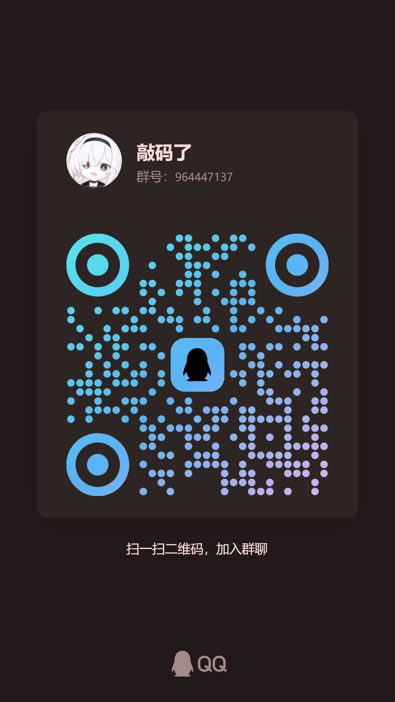

<div align="center">


# 好感度/关系管理系统 (Favour Ultra)

[](CHANGELOG.md)
[](#未来计划)
[](#联系)

<div align="left" style="width:70%">

最新动态 (2026-09-30)

* **搭话时间浮动区间 (v4.4.7)**：新增浮动幅度设置，搭话间隔从固定变为「基准 ± 浮动」随机，让机器人不再是准点搭话，而是"大概N小时想起来搭话一次"
* **修复新版依赖兼容 (v4.4.7)**：修复 Pydantic v2 / 新版 SQLModel 环境下 datetime 时区校验报错的问题
* **必看！**：如果后台显示“无法识别好感度标签”，请先尝试在预设对话中添加如下内容并清空历史对话记录！（若无效请前往反馈）
```
- 你好！
- 你好呀~[好感度 持平]
- 早上好！
- 早上好[好感度 持平]
```
  
</div>

</div>

---

## 📖 插件概述

本插件为 AstrBot 赋予了可持久保存的**好感度与人际关系系统**。它不仅仅是一个数值计数器：通过与大语言模型（LLM）联动，把好感度、关系和角色态度写入对话上下文，让 Bot 根据互动逐渐改变与你相处的方式——从陌生人、朋友，到恋人，甚至死敌。

**核心特性：**

*   **沉浸式交互与数值映射**：好感度变化由 LLM 根据对话内容判断，并体现在回复态度中。变化标签会被清理，后台静默更新数据；是否开放数值查询可单独设置。
*   **多维动态关系**：支持单边/双边人际关系确立。大模型不仅能被动接受玩家的关系请求，还能在情感共鸣时**主动确认关系**，或在触碰底线时**主动解除关系**。
*   **上下文精准注入**：基于 `<FavourContext>` 结构，实时将好感度等级、好感上限、现有关系及排他约束注入上下文，确保模型对话的人设稳定性。
*   **可视化报表与冷暴力惩罚**：支持生成图片报表直观展示排行；多次好感度降低触发真实情绪模拟，直接拒回或敷衍用户。
*   **SQLite 存储**：持久保存用户数据，支持独立会话模式与按适配器前缀共享的全局模式。
*   **WebUI 配置面板**：全功能可视化配置与数据管理面板，支持暗色模式，所有参数零代码修改。
*   **自动备份系统**：定时备份好感度记录与配置，支持 WebUI 创建、恢复和删除数据快照，备份文件保存在本地。
*   **主动搭话**：按好感度概率，在允许时段内向用户主动发起对话。搭话内容会写入对话历史并标记为系统触发，与正常用户消息区分。
*   **自定义分级与自然衰减**：自由编排等级名称、区间和态度描述，也可以让长期未互动的关系逐渐变淡。
*   **会话迁移与双向同步**：换群、换会话时复制或迁移已有记录，也可为指定会话建立持续同步关系。

### ⚠️ 主动搭话平台支持说明

主动搭话依赖平台适配器的「主动消息」能力。以下平台**支持**主动搭话：

| 平台适配器 key | 平台 | 主动搭话 |
| :--- | :--- | :--- |
| `aiocqhttp` | OneBot v11（QQ） | ✅ 支持 |
| `qqofficial` / `qqofficial_webhook` | QQ 官方机器人 | ✅ 支持（受官方客服消息时效限制） |
| `telegram` | Telegram | ✅ 支持 |
| `discord` | Discord | ✅ 支持 |
| `kook` | KOOK | ✅ 支持 |
| `lark` | 飞书 | ✅ 支持 |
| `dingtalk` | 钉钉 | ✅ 支持 |
| `slack` | Slack | ✅ 支持 |
| `mattermost` | Mattermost | ✅ 支持 |
| `misskey` | Misskey | ✅ 支持 |
| `line` | LINE | ✅ 支持 |
| `satori` | Satori | ✅ 支持 |
| `wecom_ai_bot` | 企微智能机器人 | ✅ 支持 |
| `weixin_oc` | 个人微信 | ✅ 支持 |
| `webchat` | 内置 WebChat | ✅ 支持 |
| `wecom` | 企微客服 | ⚠️ 仅非客服模式且配置了 agent_id 时支持 |
| `weixin_official_account` | 微信公众号 | ❌ 不支持，搭话功能不可用 |

> 微信公众号会被插件跳过；企微客服需满足表中的发送条件。其他平台也受各自消息权限与时效限制，开启搭话前请确认适配器具备主动发送能力。

---

## 📦 安装与配置

### 安装方法

**环境要求：AstrBot ≥ 4.24，并已配置可正常对话的 LLM 提供商。**

1.  **插件市场安装**：在 AstrBot 管理面板搜索 `Favour_Ultra` 或 `糯米茨` 进行安装。
2.  **手动安装**：

```bash
cd data/plugins
git clone https://github.com/nuomicici/astrbot_plugin_Favour_Ultra
# 重启 AstrBot 或重载插件
```

### 配置入口与保存方式

进入 **AstrBot 管理面板 → 插件管理 → 本插件详情 → Pages → 配置中心**。

新版配置由插件自行管理，保存于 `data/plugin_data/astrbot_plugin_favour_ultra/config.json`。旧版「配置」页面仅用于升级迁移，**在旧页面修改配置不会生效**。下文默认值以 v4.4.7 新安装配置为准，升级用户以配置中心实际显示的值为准。

* **参数设置**：修改后点击右上角「保存配置」。切换 Tab 会暂存表单内容，但不等于已保存；保存成功后插件会重新加载配置，并调整相关调度任务。
* **数据中心**：每条记录通过该行的保存按钮提交。
* **迁移同步与快照操作**：使用各自的复制、迁移、添加同步对、恢复等按钮执行；备份周期参数仍通过顶部「保存配置」提交。

第一次使用，建议先确认「基础设置」的数值范围，再调整「好感分级」的角色态度，最后按需开启衰减和主动搭话。

### 配置中心 Tab 导航

| Tab | 用途 |
| :--- | :--- |
| [基础设置](#tab-basic) | 判定模式、数值范围、共享策略与功能总开关 |
| [好感分级](#tab-levels) | 每个好感区间对应的等级名称和角色态度 |
| [衰减机制](#tab-decay) | 长期未互动时的扣减规则 |
| [主动搭话](#tab-active) | 搭话时段、巡检频率、触发概率、提示词与名单 |
| [权限体系](#tab-perm) | 查询权限与修改好感度的权限门槛 |
| [高级调节](#tab-adv) | 增减幅度、特权初始值、特使与会话名单 |
| [冷暴力](#tab-cold) | 连续降低惩罚、自动拉黑与回复文案 |
| [数据中心](#tab-data) | 检索、查看、编辑和删除已有记录 |
| [迁移同步](#tab-migrate) | 复制、迁移会话记录与配置双向同步 |
| [备份快照](#tab-backup) | 自动备份参数与历史快照管理 |

<a id="tab-basic"></a>
#### 1. 基础设置

决定好感度系统如何判定、保存和展示数据。

| 界面配置 / 配置键 | 默认值 | 说明 |
| :--- | :--- | :--- |
| 判定模式 `favour_mode` | `galgame` | `galgame` 偏向包容、容易培养感情；`realistic` 更强调人设边界与真实关系变化。实际增减由 LLM 结合对话判断。 |
| 列表排序方式 `group_sort_by` | `default` | `default` 按添加时间；`favour` 按好感度降序；`nickname` 按昵称；`userid` 按用户 ID。数据中心有独立的排序控件。 |
| 好感度下限 `min_favour_value` | `-200` | 好感度数值的最低边界。 |
| 好感度上限 `max_favour_value` | `1000` | 好感度数值的最高边界，建议与等级区间配合设置。 |
| 新用户初始好感 `default_favour` | `0` | 无可继承共享记录、也无特权身份的新用户初始值；不会批量重置已有数据。 |
| 全局好感度模式 `is_global_favour` | 关闭 | 关闭时按会话独立保存；开启时，同一适配器前缀下的群聊和私聊共享同一用户的数据，跨前缀仍分别保存。 |
| 向 LLM 注入关系表 `enable_relationship_table` | 开启 | 向模型补充当前会话的用户关系状态。 |
| 冷暴力系统总开关 `enable_cold_violence` | 开启 | 控制连续降低好感度触发的冷暴力机制，具体参数见「冷暴力」Tab。 |

**共享模式说明**：独立会话键形如 `aiocqhttp:GroupMessage:123456`，共享记录键则形如 `aiocqhttp`。切换模式改变的是使用哪组记录，不会自动把所有独立会话合并；新记录会尝试继承已有共享好感。需要转移既有记录时，使用「迁移同步」。

<a id="tab-levels"></a>
#### 2. 好感分级

对应 `favour_levels`。这里定义的是「这个分数下，Bot 应当怎样对待用户」，也就是好感度真正体现在对话中的部分。

| 每行字段 | 配置键 | 填写说明 |
| :--- | :--- | :--- |
| 最低分 / 最高分 | `min` / `max` | 区间包含两端，例如 `0～149`。建议按数值递增排列，避免重叠或遗漏。 |
| 等级名称 | `name` | 如「普通」「喜欢」「亲密」，可改成适合人设的称呼。 |
| 角色态度描述 | `desc` | 写明该阶段的语气、亲近程度、边界与反应，供 LLM 参考。 |

默认提供 7 个等级：

| 数值区间 | 等级 | 态度概要 |
| :--- | :--- | :--- |
| `-200～-151` | 极度厌恶 | 强烈嫌弃，提示模型限制该用户自行提升好感。 |
| `-150～-51` | 厌恶 | 抗拒交流，可通过正向互动稍微恢复。 |
| `-50～-1` | 反感 | 明显表现出反感，正常判断增减。 |
| `0～149` | 普通 | 普通朋友，态度平淡，冒犯仍会扣分。 |
| `150～299` | 喜欢 | 有一定好感，对轻微冒犯更加包容。 |
| `300～449` | 亲密 | 明显亲近，但仍保留意愿和底线。 |
| `450～500` | 挚爱 | 感情深厚，重视用户的言行。 |

* 支持添加、删除分级，顶部色谱用于预览等级顺序。
* **至少保留 3 个分级；前 7 个描述可选，第 8 个起描述必填**，否则无法保存。为了稳定表现，建议每个等级都填写描述。
* 默认最高等级区间到 `500`，数值上限是 `1000`。超出分级区间时，插件会参考相邻等级生成兜底提示；也可以把最高等级延伸到 `1000` 或继续增加等级。
* 分级描述用于引导模型，不会替代实际的数值增减与权限校验。

<a id="tab-decay"></a>
#### 3. 衰减机制

对应 `favour_decay`。让长时间没有互动的好感度自然流失，默认关闭。

| 配置项（`favour_decay.` 下） | 默认值 | 说明 |
| :--- | :--- | :--- |
| 启用好感度衰减 `enabled` | 关闭 | 开启后，每小时检查一次符合条件的用户记录。 |
| 衰减模式 `mode` | `linear` | `linear` 使用统一规则；`advanced` 按当前好感度区间匹配规则。 |
| 全局衰减底线 `floor_favour` | 留空（`null`） | 实际扣分不会低于此值；留空时使用基础设置的好感度下限。 |
| 无互动触发天数 `inactive_days` | `7` | 线性模式下，距离最近互动超过多少天才开始扣分。 |
| 每次衰减点数 `decay_amount` | `5` | 线性模式下，每轮检查扣除的点数。 |

选择分级模式后，编辑 `advanced_rules`，每行包括：

| 字段 | 说明 |
| :--- | :--- |
| `min_favour` / `max_favour` | 规则适用的好感度区间，包含两端。 |
| `inactive_days` | 该区间的无互动触发天数。 |
| `decay_amount` | 符合条件时每轮扣除的点数。 |
| `floor` | 该规则的候选判断底线，留空时回退到全局衰减底线。 |

默认分级规则为：`90～100` 超过 1 天每次减 5、底线 80；`70～89` 超过 2 天每次减 3、底线 60；`0～69` 超过 7 天每次减 2、底线 -50。按 `min_favour` 从高到低匹配第一条命中的规则，没有命中则不衰减。默认规则只覆盖 `0～100`，若使用更大的好感度范围，请相应扩展。

**触发节奏**：无互动天数是开始扣分的门槛，而非两次扣分的间隔。例如默认线性规则在超过 7 天未互动后，会每小时减 5，直到新的互动更新记录或达到底线。当前版本的分级 `floor` 用于判断是否参与衰减，单次扣分的最终截断使用 `floor_favour`；如需严格守住某个数值，请同时设置全局衰减底线。

<a id="tab-active"></a>
#### 4. 主动搭话

对应 `active_chat`。让 Bot 在允许时段内，按好感度概率主动想起用户，而不是等待每一次呼唤。

| 配置项（`active_chat.` 下） | 默认值 | 说明 |
| :--- | :--- | :--- |
| 启用主动搭话功能 `enabled` | 关闭 | 开启后台巡检，使用已有用户记录挑选搭话目标。 |
| 允许搭话开始时间 `time_start` | `08:00` | 使用 AstrBot 所在机器的本地时间，格式 `HH:MM`。 |
| 允许搭话结束时间 `time_end` | `23:30` | 当前按同一天的起止时间比较，请填写开始时间不晚于结束时间的时段。 |
| 巡检间隔 `interval_hours` | `2` 小时 | 后续巡检的基准等待时间，运行时基准最低按 1 小时计算。 |
| 浮动幅度 `interval_float_hours` | `0` 小时 | `0` 为固定间隔；大于 `0` 时，在「基准 ± 浮动」内随机等待，最低等待 0.1 小时。 |
| 每轮最多触发会话数 `max_sessions_per_round` | `3` | 限制一轮搭话的会话数量，`0` 表示不限制。每个会话每轮最多选中一名用户。 |
| 搭话会话黑名单 `blocked_sessions` | `[]` | 命中的会话不参与主动搭话。 |
| 搭话会话白名单 `allowed_sessions` | `[]` | 留空允许全部；非空时仅匹配名单内的会话。黑名单优先。 |
| 提示词模板 `llm_prompt` | 内置自然搭话模板 | 指导模型生成符合当前人设的开场白，可使用下表变量。 |

例如基准 `2` 小时、浮动 `0.5` 小时，后续巡检会随机等待 `1.5～2.5` 小时。调度器启动后约 1 分钟先检查一轮，仍需满足时段、概率和会话条件；**巡检不代表一定发消息**。

**好感度触发概率矩阵**对应 `rules`。每行的 `min_favour`、`max_favour` 为好感区间，`probability` 为百分比（`0～100`，例如 `15` 表示 15%）。默认如下：

| 好感度区间 | 每次尝试的触发概率 |
| :--- | :--- |
| `90～1000` | `15%` |
| `70～89` | `8%` |
| `50～69` | `3%` |
| `0～49` | `1%` |

规则按区间下限从高到低匹配；未覆盖的区间不触发。同一会话内优先尝试高好感用户，同分随机排序，选中一人后停止本会话本轮尝试。处于冷暴力或自动拉黑状态的用户会被排除。

| 提示词变量 | 替换内容 |
| :--- | :--- |
| `{current_time}` | 当前时间 |
| `{last_interaction_ago}` | 距上次互动的时长 |
| `{favour}` | 当前好感度 |
| `{relationship}` | 当前关系 |
| `{user_name}` | 目标用户标识 |

可在提示词编辑框下点击变量标签插入。搭话内容会写入会话历史，作为系统触发内容与普通用户消息区分；搭话合成事件不会按普通回复再更新一次好感度。发送条件见前面的「主动搭话平台支持说明」。

<a id="tab-perm"></a>
#### 5. 权限体系

控制谁能看到数值，以及谁能直接修改好感度。

| 配置项 | 默认值 | 说明 |
| :--- | :--- | :--- |
| 群聊普通用户查询 `query_permission.group_normal_user` | 允许 | 关闭后，群聊查询仅对具备相应管理权限的用户开放。 |
| 私聊普通用户查询 `query_permission.private_normal_user` | 允许 | 关闭后，私聊查询仅对 Bot 管理员开放。 |
| 修改好感度最低权限 `advanced_config.modify_favour_permission` | `admin` | `admin`：群管理员及以上；`owner`：群主及以上；`superuser`：仅 Bot 管理员。 |

Bot 管理员身份沿用 AstrBot 对当前会话的判断。群主、群管理员身份当前通过 OneBot / `aiocqhttp` 获取；其他平台的管理操作依靠 Bot 管理员身份。修改好感度的门槛不改变「修改关系」「全局维护」等命令各自的权限要求。

<a id="tab-adv"></a>
#### 6. 高级调节

对应 `advanced_config`，用于调节增减步长、初始待遇和普通对话中的会话启用范围。

| 配置项（`advanced_config.` 下） | 默认值 | 说明 |
| :--- | :--- | :--- |
| 好感上升最小值 `favour_increase_min` | `1` | 写入好感度标签生成提示的上升范围下限。 |
| 好感上升最大值 `favour_increase_max` | `3` | 上升范围上限，具体变化由 LLM 输出标签决定。 |
| 好感下降最小值 `favour_decrease_min` | `1` | 下降幅度下限，填写正数。 |
| 好感下降最大值 `favour_decrease_max` | `5` | 下降幅度上限，填写正数。 |
| 管理员初始好感 `admin_default_favour` | `50` | 无可继承共享记录时，Bot 管理员、可识别的群主和特使使用此初始值。 |
| 群等级阈值 `level_threshold` | `50` | OneBot 群成员等级达到此值时识别为高等级成员，不会因此获得群管理员权限。 |
| 好感度特使名单 `favour_envoys` | `[]` | 每项填一个用户 ID，享受特权初始好感；不赋予管理指令权限，也不保证免受冷暴力。 |
| 全局会话黑名单 `blocked_sessions` | `[]` | 在普通对话的好感度上下文注入阶段排除命中的会话。 |
| 全局会话白名单 `allowed_sessions` | `[]` | 留空时全部允许，非空时只处理匹配会话；黑名单优先。 |

**名单怎么填？**

* 会话 ID（UMO）通常是 `平台前缀:消息类型:目标ID`，例如群聊 `aiocqhttp:GroupMessage:123456`、私聊 `aiocqhttp:FriendMessage:123456`、网页会话 `webchat:FriendMessage:session_abc`。
* 优先从「迁移同步」的活动会话列表或插件日志复制真实值。每项填写一个会话，不要把多个 ID 用逗号拼成一项。
* 名单支持完整 UMO、目标 ID 和平台前缀匹配。共享模式下按共享记录键匹配，填完整会话也可能命中整个共享前缀。
* 这里的名单与「主动搭话」的名单分别配置。需要排除某会话的主动消息时，也应在主动搭话名单中设置。

<a id="tab-cold"></a>
#### 7. 冷暴力

对应 `cold_violence_config`，用于配置连续负面互动后的冷淡反应。连续降低惩罚还需在「基础设置」开启冷暴力总开关。

| 配置项（`cold_violence_config.` 下） | 默认值 | 说明 |
| :--- | :--- | :--- |
| 连续降低好感触发次数 `consecutive_decrease_threshold` | `3` | 连续降低次数**达到**此值触发；上升或持平会清零连续次数。 |
| 冷暴力持续时间 `duration_minutes` | `30` 分钟 | 触发后拦截普通对话的持续时间。 |
| 跨会话全局冷暴力 `is_global` | 关闭 | 开启后以用户 ID 统一记录冷暴力状态，使其跨会话生效。 |
| 达好感下限时自动拉黑 `auto_blacklist_on_min` | 关闭 | 对话更新或自然衰减使好感达到下限时，加入插件的自动拉黑状态。该项独立于连续降低总开关。 |
| 触发附加提示 `replies.on_trigger` | `......（我不想理你了。）` | 触发时追加到回复中的文案。 |
| 拦截对话回复 `replies.on_message` | `[自动回复]不想理你,{time_str}后再找我` | 冷暴力期间收到普通消息时使用。 |
| 查询好感回复 `replies.on_query` | `冷暴力呢，看什么看，{time_str}之后再找我说话` | 冷暴力期间查询好感时使用。 |

`on_message` 和 `on_query` 中的 `{time_str}` 会替换为剩余时间。管理员可通过 `/查看冷暴力列表` 查看状态，通过 `/取消冷暴力 @用户` 解除该用户的冷暴力及自动拉黑状态。

<a id="tab-data"></a>
#### 8. 数据中心

这里直接管理已保存的用户记录。

| 功能 | 使用说明 |
| :--- | :--- |
| 统计卡片 | 展示总好感记录、最高好感度、覆盖会话数和最低好感度；总记录数不等于去重用户数。 |
| 搜索 | 支持用户 ID、用户名、关系称号、会话 UMO 等关键词。 |
| 分类筛选 | 可查看全部、仅群聊、仅私聊或仅全局记录。 |
| 排序与折叠 | 支持好感度升降序、UID 升降序、关系唯一性优先、昵称排序；可逐项或全部展开会话。 |
| 编辑记录 | 可修改昵称、好感度、关系名称、关系唯一性，完成后点击**该行保存按钮**。 |
| 删除记录 | 点击该行删除按钮并确认，删除对应用户记录。 |
| 刷新 | 重新读取数据库；迁移或同步后可在此确认结果。 |

该页的筛选、排序用于查阅数据，修改用户记录不使用顶部「保存配置」。若记录所在会话已建立同步对，相应数据变动也会传播到配对会话。

<a id="tab-migrate"></a>
#### 9. 迁移同步

用于把一段关系带到新的会话，或让指定会话持续共享记录。

**会话数据迁移与复制**

| 设置 / 操作 | 说明 |
| :--- | :--- |
| 源会话 UMO | 需要读取记录的会话，可从活动会话列表点击「设为源」。 |
| 目标会话 UMO | 需要写入记录的会话，可点击「设为目标」或填写真实 UMO；应与源不同。 |
| `merge` 合并（默认） | 保留目标独有用户；相同用户 ID 的记录以源会话数据覆盖。 |
| `replace` 覆盖 | 先清空目标会话，再完整复制源会话记录。 |
| 预览源会话 | 查看源会话的记录数量、用户、好感度和关系。 |
| 一键复制数据 | 写入目标，保留源会话记录。 |
| 一键迁移（清空源） | 转移记录到目标后，清空源会话记录。 |
| 刷新可用会话 | 更新数据库和运行时已知的会话列表。 |

复制和迁移是一次性操作。`replace` 会覆盖目标已有记录，迁移会清空源记录，执行前可在「备份快照」创建快照。

**双向完全同步对管理**

对应 `session_sync.pairs`，默认空列表。每对包含会话 A `a`、会话 B `b`、启用状态 `enabled` 和备注 `note`。

1. 填写两个不同的真实 UMO 和可选备注，点击「添加同步对」；新同步对默认启用并立即保存。
2. 如需先统一已有数据，选择「立即 A → B」「立即 B → A」或「双向同步」。
3. 启用期间，好感度、关系、唯一性及相关用户字段的变更会传播到直接配对会话；可随时禁用或删除同步对。

手动同步采用 `merge`。**「双向同步」按先 A → B、再 B → A 的顺序执行，同一用户冲突时最终以 A 的原始数据为准**。添加同步对本身不会立即合并存量记录；同步按相同用户 ID 进行，不自动绑定跨平台的不同账号，也不会递归传遍多级同步链。

<a id="tab-backup"></a>
#### 10. 备份快照

设置自动备份周期，并管理本地历史快照。

| 配置项（`backup.` 下） | 运行默认值 | 说明 |
| :--- | :--- | :--- |
| 启用自动备份 `enabled` | 开启 | 定期导出好感度记录，同时备份插件配置。 |
| 备份间隔 `interval_hours` | `3` 小时 | 自动备份的执行间隔，修改后点击顶部「保存配置」。 |
| 保留时间 `retention_hours` | `24` 小时 | 自动清理超过保留时间的本地 JSON 备份，按文件修改时间判断。 |

| 快照操作 | 说明 |
| :--- | :--- |
| 立即创建备份快照 | 手动导出当前全部好感度记录。 |
| 刷新备份列表 | 重新查看已有快照文件及大小。 |
| 恢复此备份 | 使用选定的数据快照**替换全部现有好感度记录**，需要确认。 |
| 删除快照 | 删除选中的本地备份文件，需要确认。 |

快照位于 `data/plugin_data/astrbot_plugin_favour_ultra/backups/`，数据快照是 JSON 记录导出。自动备份还会生成 `config_*.json` 配置副本；它不是数据记录快照，不应用数据恢复按钮导入。若需下载留存，请从服务器的备份目录复制文件，当前页面提供创建、恢复和删除操作。

---

## 💻 命令使用手册

在对话中发送 `/好感度帮助` 查看当前身份可用的命令，发送 `/好感度指令帮助` 查看参数示例。下表省略统一的 `/` 前缀，实际使用时按 AstrBot 配置的指令前缀发送。

### 1. 通用命令

查询类命令是否向普通用户开放，由「权限体系」Tab 控制。

| 命令 | 示例 | 描述 |
| :--- | :--- | :--- |
| `查询好感度` | `查询好感度 @某人` | **[文本]** 查询自己或指定用户的详细数据。 |
| `查询当前好感度 [页码]` | `查询当前好感度 2` | **[图片]** 查看当前会话的数据表格；也可使用别名 `本群好感度`。 |
| `好感度帮助` | `好感度帮助` | 根据当前身份显示可用命令菜单。 |
| `好感度指令帮助` | `好感度指令帮助` | 查看详细的指令用法说明。 |

### 2. 管理员命令

> **权限说明**：
> *   **Bot管理员**：由 AstrBot 当前会话配置识别的管理员（最高权限）。
> *   **群主**：当前群聊拥有者。
> *   **群管理员**：当前群聊管理员。

| 命令 | 权限 | 描述 |
| :--- | :--- | :--- |
| `修改好感度 <@用户> <数值>` | 默认群管+，可配置 | 将指定用户好感度设置为目标数值。 |
| `修改关系 <@用户> <名称> <1/0>` | 群主+ | 强制修改关系。`1`表示唯一关系(如恋人)，`0`表示非唯一。 |
| `解除关系 <@用户>` | 群主+ | 清除指定用户的所有关系状态。 |
| `清空好感度 <@用户>` | 群主+ | 删除指定用户在当前会话中的记录，需二次确认。 |
| `清空当前好感度` | 群主+ | **[慎用]** 清空当前会话的所有数据（需二次确认）。 |

### 3. Bot 管理员专属命令 (全局维护)

| 命令 | 描述 |
| :--- | :--- |
| `查询全部好感度` | **[图片]** 按会话分组展示所有数据。*注：在群聊中使用时会自动隐藏私聊会话数据。* |
| `查询全局好感度` | **[图片]** 查询全局模式下的数据记录。 |
| `全局修改好感度` | 修改指定用户在**所有会话**中的好感度。 |
| `全局修改关系` | 修改指定用户在**所有会话**中的关系。 |
| `全局解除关系` | 解除指定用户在**所有会话**中的关系。 |
| `跨会话修改` | 远程修改指定会话的数据。格式：`/跨会话修改 <SID> <操作> ...` |
| `取消冷暴力 <@用户或用户ID>` | 解除指定用户的冷暴力、连续降低计数及自动拉黑状态。 |
| `查看冷暴力列表` | 查看当前冷暴力与自动拉黑状态。 |
| `清空全局好感度` | 清空共享模式记录，需二次确认。 |

---

## ⚙️ 核心机制解析

### 1. 动态上下文注入 (Dynamic Context)
插件会实时解析当前交互对象，并将状态通过 `<FavourContext>` 节点注入动态用户上下文。这包含了当前交互对象的 ID、管理权限、好感度数值与等级、已建立的单边/排他性关系等信息，甚至包含了对当前好感度上限的动态约束声明与末行日志强制提示。系统借此引导大模型在生成回复时做出最符合当前关系阶段与身份设定的选择。

### 2. 多态输出控制与隐形标签系统
回复末尾由 LLM 根据内置的**逻辑门**（GALGAME/REALISTIC 模式）输出专属的情感或关系变动标签，插件捕捉后会自动截断并在后台记录，实现数据流转而玩家无感知：
*   **基础好感波动**：`[好感度 上升：X]` / `[好感度 降低：Y]` / `[好感度 持平]`
*   **玩家关系申请**：`[用户申请确认关系:目标用户ID:关系名称:同意(true/false):排他性(true/false)]`
*   **主动关系确立**：`[主动确认关系:目标用户ID:关系名称:排他性(true/false)]`
*   **主动关系解除**：`[主动解除关系:目标用户ID:关系名称]`

### 3. 智能 T2I 报表与隐私保护
当查询多人数据（如 `查询当前好感度`）时，插件会自动调用 AstrBot 的文本转图片引擎。
*   **智能折叠**：若某会话人数过多，会自动显示前5名和后5名，中间折叠，保证图片可读性。
*   **隐私屏蔽**：在群聊中查询全部数据时，会自动隐藏私聊会话的详细记录。

### 4. 冷暴力机制
当好感度连续触发 `降低` 且达到设定阈值时（默认连续 3 次）：
1.  **锁定**：记录用户及解锁时间（默认 30 分钟）。
2.  **拦截**：该用户发送的消息被自动阻断，不再透传给 LLM 消耗 Token。
3.  **回绝**：直接向其返回冰冷的预设文本（如：“我现在不想理你”）。

---

## 💾 数据存储与迁移

插件采用 **SQLite** 数据库存储数据，以提供更高的性能和查询能力。

*   **数据库文件**：`data/plugin_data/astrbot_plugin_favour_ultra/favour.db`
*   **配置文件**：`data/plugin_data/astrbot_plugin_favour_ultra/config.json`，由 Pages 配置中心维护。
*   **自动迁移**：插件启动时会自动检测旧版的 `haogan.json` 等配置。旧数据会自动导入数据库，原文件将被重命名为 `.json.bak` 进行安全备份。
*   **旧配置迁移**：首次生成新版配置时会检测 `data/config/` 下的旧版框架配置，迁移后保留 `.json.v3_1_backup` 副本。升级后请重新检查分级规则与数值范围。
*   **会话间迁移**：在「迁移同步」Tab 操作，可选择保留源记录的复制，或清空源记录的迁移。

### 🗄️ 备份系统

插件内置自动备份机制，保障数据安全：

*   **自动备份**：默认每 3 小时自动备份一次，备份文件保存于 `data/plugin_data/astrbot_plugin_favour_ultra/backups/` 目录
*   **WebUI 管理**：在「备份快照」Tab 中查看、创建、恢复或删除数据备份；恢复会替换全部当前记录。
*   **配置项**：使用 `backup.enabled`、`backup.interval_hours` 与 `backup.retention_hours` 调整策略，默认开启、间隔 3 小时、保留 24 小时。
*   **配置恢复**：当 `config.json` 丢失或损坏时，启动阶段会尝试从最近的 `config_*.json` 备份恢复；损坏原文件会另存为 `.json.corrupt_backup`。

### 更新日志

完整版本变化见 [CHANGELOG.md](CHANGELOG.md)。如果新版运行异常，可通过 [旧版回退分支](https://github.com/nuomicici/astrbot_plugin_Favour_Ultra/tree/older) 获取旧版，反馈时请附上插件版本、AstrBot 版本、使用平台与相关日志。

### 未来计划

欢迎通过下方联系方式提出想要的功能、交互方式和适配需求，来许愿！版本进展会记录在更新日志中。

---

## 联系

如果您在使用中遇到问题，或有新的功能建议，欢迎反馈：

| 作者信息 | 交流/反馈 |
| :--- | :--- |
| **作者**: 糯米茨<br>**联系方式**: （许愿通道）<br>- [GitHub Issues](https://github.com/nuomicici/astrbot_plugin_Favour_Ultra/issues)<br>- [QQ](https://qm.qq.com/q/wMGXYfKKoS) |  |

<div align="center">
如果不介意的话，可以给项目点一个 Star ⭐ 支持一下！
</div>
